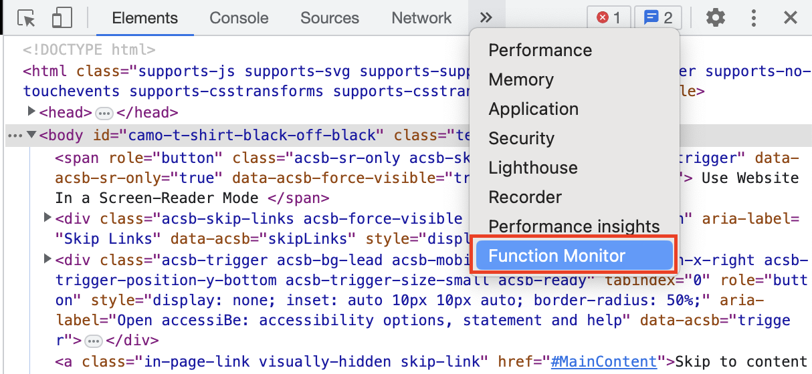

# Chrome Function Monitor Extension

## Features
This extension allows you to monitor a webpage for calls of a specified function, and records and lists those function calls in a tab in the inspector. It's meant to be a simple utility to help capture what's happening on a website's frontend. Once a valid function has been entered into the UI, the extension will automatically update with the details of subsequent calls to that function, and will show details of the invocation such as the timestamp and call arguments, which can be displayed as JSON text or in a tree view. You can also copy the JSON data to the clipboard.

## To install
The extension isn't published to the Chrome Web Store yet as it's currently being reviewed for publishing. To install:
1. Clone this repository onto your hard drive.
2. Follow the **Loading an unpacked extension** steps here, using the `build` folder from this repository as the extension directory: [https://developer.chrome.com/docs/extensions/mv3/getstarted/development-basics/#load-unpacked](https://developer.chrome.com/docs/extensions/mv3/getstarted/development-basics/#load-unpacked)

This project was bootstrapped with [Create React App](https://github.com/facebook/create-react-app).

## How to use

1. Navigate to any website and open the Inspector (right click within the webpage and select "Inspect" from the context menu). 
2. Right click and open the inspector, then find the "Function Monitor" tab.

3. Type in the name of a function that exists on the frontend of the webpage (eg `window.dataLayer.push`)- autocomplete will bring up some suggestions of functions the extension has found.
4. Click "Enable Listener." The extension will automatically attempt to re-register the function call listener on refresh and page navigation.

## Development
This UI for this project was created using React and PrimeReact.